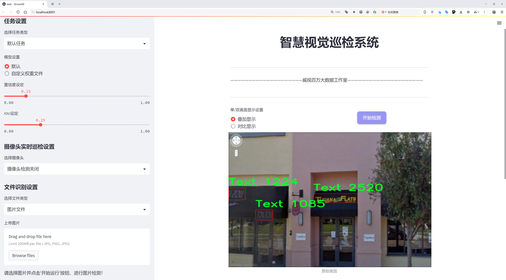
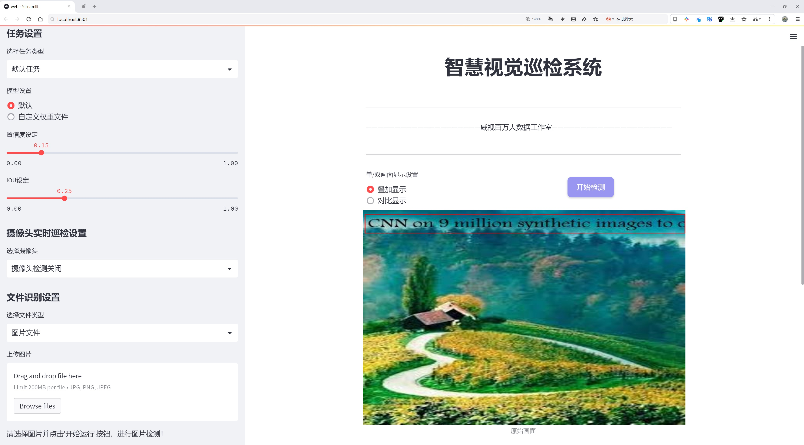
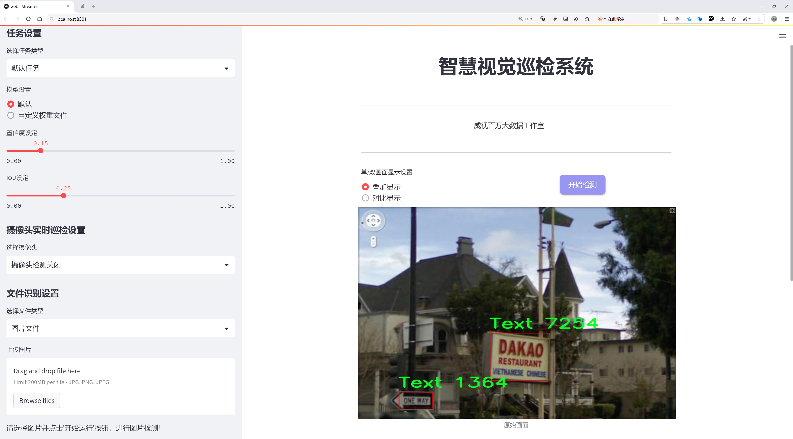
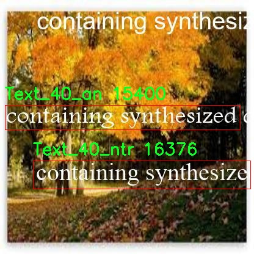
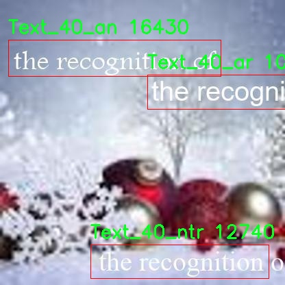
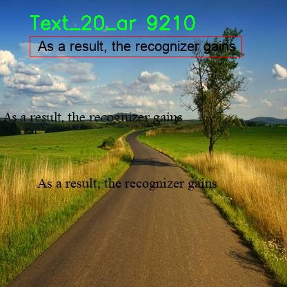
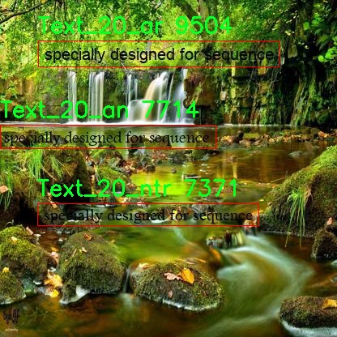

# 店铺名称检测检测系统源码分享
 # [一条龙教学YOLOV8标注好的数据集一键训练_70+全套改进创新点发刊_Web前端展示]

### 1.研究背景与意义

项目参考[AAAI Association for the Advancement of Artificial Intelligence](https://gitee.com/qunmasj/projects)

研究背景与意义

随着信息技术的迅猛发展，计算机视觉在各个领域的应用日益广泛，尤其是在图像识别和目标检测方面。店铺名称的自动检测与识别，作为计算机视觉技术的一项重要应用，正逐渐成为商业智能、城市管理和智能交通等领域的重要研究方向。店铺名称不仅承载着商业信息，还反映了城市的文化与经济发展。因此，开发高效、准确的店铺名称检测系统具有重要的现实意义。

近年来，YOLO（You Only Look Once）系列模型因其高效的实时检测能力而受到广泛关注。YOLOv8作为该系列的最新版本，在目标检测精度和速度上均有显著提升。然而，传统YOLO模型在特定场景下的表现仍存在一定的局限性，尤其是在复杂背景、光照变化及多样化字体等情况下的文本检测。因此，基于改进YOLOv8的店铺名称检测系统的研究显得尤为重要。

本研究将利用SVT_Total_LCT数据集，该数据集包含3069张图像，涵盖21个类别的文本信息，能够为模型的训练和测试提供丰富的样本。这些类别包括不同的文本样式和排列方式，体现了店铺名称在实际应用中的多样性。通过对该数据集的深入分析和处理，可以有效提升模型在复杂环境下的鲁棒性和准确性。

在技术层面，本研究将针对YOLOv8模型进行改进，主要集中在网络结构优化、数据增强及后处理策略等方面。通过引入新的特征提取模块和优化算法，期望能够提升模型对不同字体、颜色和背景的适应能力。此外，数据增强技术的应用将进一步丰富训练样本，增强模型的泛化能力，降低过拟合风险。

从应用角度来看，基于改进YOLOv8的店铺名称检测系统将为商业智能提供有力支持。通过实时识别和分析店铺名称，商家可以更好地了解市场动态和消费者需求，从而优化营销策略和产品布局。同时，城市管理者可以利用该系统对城市商业活动进行监测和分析，为城市规划和管理提供数据支持。

综上所述，基于改进YOLOv8的店铺名称检测系统的研究不仅具有重要的学术价值，也为实际应用提供了新的思路和方法。通过对该领域的深入探索，期望能够推动计算机视觉技术在商业和城市管理中的广泛应用，为相关行业的发展提供技术保障。

### 2.图片演示







##### 注意：由于此博客编辑较早，上面“2.图片演示”和“3.视频演示”展示的系统图片或者视频可能为老版本，新版本在老版本的基础上升级如下：（实际效果以升级的新版本为准）

  （1）适配了YOLOV8的“目标检测”模型和“实例分割”模型，通过加载相应的权重（.pt）文件即可自适应加载模型。

  （2）支持“图片识别”、“视频识别”、“摄像头实时识别”三种识别模式。

  （3）支持“图片识别”、“视频识别”、“摄像头实时识别”三种识别结果保存导出，解决手动导出（容易卡顿出现爆内存）存在的问题，识别完自动保存结果并导出到。

  （4）支持Web前端系统中的标题、背景图等自定义修改，后面提供修改教程。

  另外本项目提供训练的数据集和训练教程,暂不提供权重文件（best.pt）,需要您按照教程进行训练后实现图片演示和Web前端界面演示的效果。

### 3.视频演示

[3.1 视频演示](https://www.bilibili.com/video/BV1JXs5ecE6L/?vd_source=ff015de2d29cbe2a9cdbfa7064407a08)

### 4.数据集信息展示

数据集信息展示

本数据集名为SVT_Total_LCT，专为改进YOLOv8的店铺名称检测系统而设计。该数据集包含3069幅图像，涵盖21个类别，旨在提供丰富的训练素材，以提高模型在复杂环境中对店铺名称的识别能力。数据集的构建考虑到了多样性和复杂性，确保模型能够在各种场景下进行有效的对象检测。

在这21个类别中，图像被细分为不同的文本类型，如Text、Text1、Text3等，具体类别包括Text_20_an、Text_20_ar、Text_20_ntr等，直至Text_70_an、Text_70_ar和Text_70_ntr。这种分类方式不仅帮助模型理解不同文本的特征，还能提升其在多语言和多样化字体环境下的适应能力。通过对这些类别的训练，模型能够识别出不同语言和风格的店铺名称，从而在实际应用中实现更高的准确率。

该数据集的图像数量相对丰富，3069幅图像为模型提供了足够的样本量，以进行有效的训练和验证。每幅图像都经过精心标注，确保训练过程中模型能够学习到准确的特征。图像的多样性包括不同的拍摄角度、光照条件和背景环境，这些因素都是影响店铺名称识别性能的重要变量。通过引入这些变化，SVT_Total_LCT数据集旨在提高模型的鲁棒性，使其在实际应用中能够更好地应对各种挑战。

此外，SVT_Total_LCT数据集的使用遵循CC BY 4.0许可证，这意味着用户可以自由地使用、修改和分发数据集，只需在使用时给予适当的署名。这种开放的许可方式促进了学术界和工业界的合作，鼓励研究人员和开发者在此基础上进行创新和改进。

数据集的提供者是Roboflow社区的一位用户，反映了社区在推动计算机视觉领域发展方面的努力。通过分享高质量的数据集，研究人员可以更快地验证和优化他们的模型，推动技术的进步。SVT_Total_LCT数据集不仅是一个训练工具，更是一个促进知识共享和技术交流的平台。

总之，SVT_Total_LCT数据集为改进YOLOv8的店铺名称检测系统提供了坚实的基础。其丰富的图像样本和多样的类别设置，使得模型在训练过程中能够获得更全面的学习体验。随着数据集的广泛应用，期待能够在店铺名称检测领域取得更大的突破，为商业智能和自动化服务的提升贡献力量。










### 5.全套项目环境部署视频教程（零基础手把手教学）

[5.1 环境部署教程链接（零基础手把手教学）](https://www.ixigua.com/7404473917358506534?logTag=c807d0cbc21c0ef59de5)


[5.2 安装Python虚拟环境创建和依赖库安装视频教程链接（零基础手把手教学）](https://www.ixigua.com/7404474678003106304?logTag=1f1041108cd1f708b01a)

### 6.手把手YOLOV8训练视频教程（零基础小白有手就能学会）

[6.1 环境部署教程链接（零基础手把手教学）](https://www.ixigua.com/7404477157818401292?logTag=d31a2dfd1983c9668658)

### 7.70+种全套YOLOV8创新点代码加载调参视频教程（一键加载写好的改进模型的配置文件）

[7.1 环境部署教程链接（零基础手把手教学）](https://www.ixigua.com/7404478314661806627?logTag=29066f8288e3f4eea3a4)

### 8.70+种全套YOLOV8创新点原理讲解（非科班也可以轻松写刊发刊，V10版本正在科研待更新）

由于篇幅限制，每个创新点的具体原理讲解就不一一展开，具体见下列网址中的创新点对应子项目的技术原理博客网址【Blog】：


[8.1 70+种全套YOLOV8创新点原理讲解链接](https://gitee.com/qunmasj/good)

### 9.系统功能展示（检测对象为举例，实际内容以本项目数据集为准）

图1.系统支持检测结果表格显示

  图2.系统支持置信度和IOU阈值手动调节

  图3.系统支持自定义加载权重文件best.pt(需要你通过步骤5中训练获得)

  图4.系统支持摄像头实时识别

  图5.系统支持图片识别

  图6.系统支持视频识别

  图7.系统支持识别结果文件自动保存

  图8.系统支持Excel导出检测结果数据


### 10.原始YOLOV8算法原理

原始YOLOv8算法原理

YOLOv8（You Only Look Once version 8）是YOLO系列目标检测算法中的最新版本，旨在提高目标检测的精度和速度。相较于其前身，YOLOv8采用了anchor-free的检测方法，这一转变使得模型在处理复杂场景时，尤其是在小目标检测方面，表现得更加出色。YOLOv8的设计理念是通过高效的特征提取和优化的网络结构，实现实时目标检测，同时保持较高的准确性。

YOLOv8的网络结构主要由四个模块组成：输入端、主干网络、Neck端和输出端。输入端负责对输入图像进行预处理，包括Mosaic数据增强、自适应图像缩放和灰度填充等。这些预处理步骤旨在提升模型的鲁棒性和泛化能力，尽管在训练的最后阶段会停止使用Mosaic数据增强，以避免对数据真实分布的破坏。

在主干网络中，YOLOv8采用了C2f模块替代了之前的C3模块。C2f模块的设计灵感来源于YOLOv7中的ELAN结构，增加了跳层连接，从而能够更有效地捕获梯度流信息。这种结构不仅提升了特征提取的效率，还在保持模型轻量化的同时，增强了特征的表达能力。SPPF（Spatial Pyramid Pooling Fast）模块的保留则进一步优化了模型的执行时间，确保在特征提取过程中不会造成显著的性能损失。

Neck端的设计基于PAN（Path Aggregation Network）结构，通过上采样和下采样的结合，进行不同尺度特征图的融合。这一过程确保了模型能够有效地利用多尺度信息，从而提升对不同大小目标的检测能力。Neck端的优化不仅提高了特征融合的效果，还降低了计算复杂度，使得YOLOv8在推理时能够实现更快的速度。

在输出端，YOLOv8采用了解耦头（Decoupled Head）结构，分别处理分类和回归任务。这种设计思路使得分类任务和定位任务可以独立优化，提升了模型的收敛速度和预测精度。通过引入Task-Aligned Assigner（任务对齐分配器），YOLOv8能够对分类分数和回归分数进行加权匹配，确保在训练过程中，正样本的选择更加合理。损失计算方面，YOLOv8使用了BCE（Binary Cross-Entropy）损失函数来计算分类损失，而回归损失则采用了DFL（Distribution Focal Loss）和CIoU（Complete Intersection over Union）损失函数。这种多样化的损失计算方式，进一步提升了模型的检测性能。

尽管YOLOv8在许多方面进行了优化，但在某些复杂环境下，如水面环境中，小目标的检测仍然面临挑战。小目标漂浮物的特征复杂且背景多样，导致YOLOv8在定位精度和目标感知能力上存在不足。为了解决这些问题，研究者们提出了YOLOv8-WSSOD算法，通过引入BiFormer双层路由注意力机制构建C2fBF模块，以减轻主干网络下采样过程中的噪声影响，保留更细粒度的上下文信息。此外，针对小目标漏检问题，YOLOv8-WSSOD还添加了一个更小的检测头，以提升网络对小目标的感知能力。

在Neck端，YOLOv8-WSSOD引入了GSConv和Slim-neck技术，这些技术的结合不仅保持了检测精度，还有效降低了计算量。最后，YOLOv8-WSSOD使用MPDIoU损失函数替换了CIoU损失函数，以提高模型的泛化能力和精准度。这些改进使得YOLOv8-WSSOD在复杂环境下的表现得到了显著提升，能够更好地满足实际应用需求。

综上所述，YOLOv8通过其创新的网络结构和优化的训练策略，在目标检测领域取得了显著的进展。尽管在某些特定场景下仍存在挑战，但通过不断的改进和优化，YOLOv8及其衍生算法如YOLOv8-WSSOD展现了良好的应用前景，尤其是在需要实时性和准确性的任务中，具有广泛的研究和应用价值。随着技术的不断发展，未来的YOLO系列算法有望在更复杂的环境中实现更高的检测精度和速度，为目标检测领域带来更多的可能性。


### 11.项目核心源码讲解（再也不用担心看不懂代码逻辑）

#### 11.1 ultralytics\utils\plotting.py

以下是对您提供的代码的核心部分进行分析和详细注释的结果。为了保持代码的简洁性和可读性，我将保留主要功能和类，同时添加详细的中文注释。

```python
import numpy as np
import cv2
from PIL import Image, ImageDraw, ImageFont

class Colors:
    """
    颜色类，用于处理颜色调色板。
    提供将十六进制颜色代码转换为RGB值的方法。
    """

    def __init__(self):
        """初始化颜色调色板。"""
        hexs = (
            "FF3838", "FF9D97", "FF701F", "FFB21D", "CFD231",
            "48F90A", "92CC17", "3DDB86", "1A9334", "00D4BB",
            "2C99A8", "00C2FF", "344593", "6473FF", "0018EC",
            "8438FF", "520085", "CB38FF", "FF95C8", "FF37C7",
        )
        # 将十六进制颜色转换为RGB
        self.palette = [self.hex2rgb(f"#{c}") for c in hexs]
        self.n = len(self.palette)

    @staticmethod
    def hex2rgb(h):
        """将十六进制颜色代码转换为RGB值。"""
        return tuple(int(h[i:i + 2], 16) for i in (1, 3, 5))

colors = Colors()  # 创建颜色实例

class Annotator:
    """
    注释类，用于在图像上绘制框、文本和关键点。
    """

    def __init__(self, im, line_width=None, font_size=None, font="Arial.ttf", pil=False):
        """初始化Annotator类，设置图像和绘制参数。"""
        self.im = im if isinstance(im, Image.Image) else Image.fromarray(im)
        self.draw = ImageDraw.Draw(self.im)
        self.lw = line_width or 2  # 默认线宽
        self.font = ImageFont.truetype(font, font_size or 12)  # 设置字体

    def box_label(self, box, label="", color=(128, 128, 128)):
        """在图像上绘制一个框和标签。"""
        self.draw.rectangle(box, outline=color)  # 绘制矩形框
        if label:
            self.draw.text((box[0], box[1]), label, fill=(255, 255, 255), font=self.font)  # 绘制标签

    def kpts(self, kpts, radius=5):
        """在图像上绘制关键点。"""
        for k in kpts:
            x, y = int(k[0]), int(k[1])
            self.draw.ellipse((x - radius, y - radius, x + radius, y + radius), fill=(0, 255, 0))  # 绘制圆形关键点

    def result(self):
        """返回注释后的图像。"""
        return np.asarray(self.im)

def plot_images(images, fname="images.jpg"):
    """绘制图像网格并保存。"""
    mosaic = np.full((640, 640, 3), 255, dtype=np.uint8)  # 创建白色背景
    for i, img in enumerate(images):
        mosaic[i // 8 * 80:(i // 8 + 1) * 80, (i % 8) * 80: (i % 8 + 1) * 80] = img  # 将图像放入网格
    cv2.imwrite(fname, mosaic)  # 保存图像

# 示例使用
if __name__ == "__main__":
    # 创建一个空白图像
    img = np.zeros((640, 640, 3), dtype=np.uint8)
    annotator = Annotator(img)
    annotator.box_label((50, 50, 200, 200), label="目标", color=(255, 0, 0))  # 绘制框和标签
    annotator.kpts(np.array([[100, 100], [150, 150]]))  # 绘制关键点
    result_img = annotator.result()  # 获取结果图像
    plot_images([result_img], fname="output.jpg")  # 保存结果图像
```

### 代码分析和注释
1. **Colors类**: 负责管理颜色调色板，提供将十六进制颜色转换为RGB格式的方法。
2. **Annotator类**: 用于在图像上绘制框、文本和关键点。构造函数初始化图像和绘制参数，`box_label`方法绘制矩形框和标签，`kpts`方法绘制关键点。
3. **plot_images函数**: 将多个图像绘制成网格并保存为文件。

以上是对代码的核心部分进行了提炼和注释，便于理解其功能和使用方法。

这个文件是Ultralytics YOLO项目中的一个工具模块，主要用于图像的绘制和可视化，特别是在目标检测和姿态估计任务中。它包含多个类和函数，旨在帮助用户在图像上绘制边界框、关键点、掩码等，并提供可视化的结果。

首先，文件中定义了一个`Colors`类，用于管理和转换颜色。该类包含一组预定义的颜色，支持将十六进制颜色代码转换为RGB格式。这个类的实例可以通过索引获取颜色，方便在绘制时使用。

接下来是`Annotator`类，它是该模块的核心，负责在图像上添加各种注释。初始化时，它接受图像、线宽、字体等参数，并根据使用的绘图库（PIL或OpenCV）设置绘图环境。该类提供了多种方法，例如绘制矩形框、文本、关键点、掩码等。它还包含了绘制特定姿态关键点的功能，并可以连接关键点以形成骨架。

`box_label`方法用于在图像上绘制边界框和标签，支持旋转框的绘制。`masks`方法用于在图像上绘制掩码，支持透明度设置。`kpts`方法用于绘制关键点，并可以选择是否连接关键点。`draw_region`和`draw_centroid_and_tracks`方法则用于绘制区域和轨迹，适用于目标跟踪任务。

此外，文件中还定义了一些绘图函数，例如`plot_labels`用于绘制训练标签的统计信息，`save_one_box`用于保存图像的裁剪部分，`plot_images`用于绘制图像网格并标注信息，`plot_results`用于绘制训练结果等。这些函数提供了丰富的可视化功能，方便用户分析模型的性能和结果。

文件的最后部分还包含一些静态方法，例如`plt_color_scatter`用于绘制散点图，`output_to_target`和`output_to_rotated_target`用于将模型输出转换为可绘制的目标格式，`feature_visualization`用于可视化模型的特征图。

总体而言，这个文件提供了强大的图像处理和可视化功能，帮助用户在目标检测和姿态估计等任务中更好地理解和分析模型的表现。

#### 11.2 ui.py

```python
import sys
import subprocess

def run_script(script_path):
    """
    使用当前 Python 环境运行指定的脚本。

    Args:
        script_path (str): 要运行的脚本路径

    Returns:
        None
    """
    # 获取当前 Python 解释器的路径
    python_path = sys.executable

    # 构建运行命令
    command = f'"{python_path}" -m streamlit run "{script_path}"'

    # 执行命令
    result = subprocess.run(command, shell=True)
    if result.returncode != 0:
        print("脚本运行出错。")


# 实例化并运行应用
if __name__ == "__main__":
    # 指定您的脚本路径
    script_path = "web.py"  # 这里可以直接指定脚本路径

    # 运行脚本
    run_script(script_path)
```

### 代码核心部分及注释

1. **导入模块**：
   ```python
   import sys
   import subprocess
   ```
   - `sys` 模块用于访问与 Python 解释器紧密相关的变量和函数，例如获取当前 Python 解释器的路径。
   - `subprocess` 模块用于执行外部命令和脚本。

2. **定义 `run_script` 函数**：
   ```python
   def run_script(script_path):
   ```
   - 该函数接收一个参数 `script_path`，表示要运行的 Python 脚本的路径。

3. **获取当前 Python 解释器的路径**：
   ```python
   python_path = sys.executable
   ```
   - 使用 `sys.executable` 获取当前 Python 解释器的完整路径，以便后续运行脚本时使用。

4. **构建运行命令**：
   ```python
   command = f'"{python_path}" -m streamlit run "{script_path}"'
   ```
   - 使用格式化字符串构建命令，调用 `streamlit` 模块来运行指定的脚本。

5. **执行命令**：
   ```python
   result = subprocess.run(command, shell=True)
   ```
   - 使用 `subprocess.run` 执行构建的命令，`shell=True` 允许在 shell 中执行命令。

6. **检查命令执行结果**：
   ```python
   if result.returncode != 0:
       print("脚本运行出错。")
   ```
   - 检查命令的返回码，如果不为 0，表示脚本运行出错，打印错误信息。

7. **主程序入口**：
   ```python
   if __name__ == "__main__":
   ```
   - 确保只有在直接运行该脚本时才会执行以下代码。

8. **指定脚本路径并运行**：
   ```python
   script_path = "web.py"  # 这里可以直接指定脚本路径
   run_script(script_path)
   ```
   - 指定要运行的脚本路径，并调用 `run_script` 函数执行该脚本。

这个程序文件的主要功能是使用当前的 Python 环境来运行一个指定的脚本，具体是通过 Streamlit 来启动一个 Web 应用。程序首先导入了必要的模块，包括 `sys`、`os` 和 `subprocess`，以及一个自定义的路径处理模块 `abs_path`。

在 `run_script` 函数中，首先获取当前 Python 解释器的路径，这样可以确保使用的是正确的 Python 环境。接着，构建一个命令字符串，这个命令会调用 Streamlit 来运行指定的脚本。命令的格式是 `python -m streamlit run script_path`，其中 `script_path` 是传入的参数。

然后，使用 `subprocess.run` 方法来执行这个命令。该方法会在一个新的 shell 中运行命令，并等待其完成。如果命令执行的返回码不为零，表示脚本运行出错，程序会输出一条错误信息。

在文件的最后部分，使用 `if __name__ == "__main__":` 语句来确保只有在直接运行该文件时才会执行后面的代码。在这里，指定了要运行的脚本路径为 `web.py`，并调用 `run_script` 函数来启动这个脚本。

整体来看，这个程序的设计是为了方便用户在一个统一的环境中启动和运行一个基于 Streamlit 的 Web 应用。

#### 11.3 ultralytics\models\yolo\obb\train.py

以下是代码中最核心的部分，并附上详细的中文注释：

```python
# 导入必要的模块
from ultralytics.models import yolo
from ultralytics.nn.tasks import OBBModel
from ultralytics.utils import DEFAULT_CFG, RANK

class OBBTrainer(yolo.detect.DetectionTrainer):
    """
    OBBTrainer类，扩展了DetectionTrainer类，用于基于定向边界框（OBB）模型的训练。
    """

    def __init__(self, cfg=DEFAULT_CFG, overrides=None, _callbacks=None):
        """初始化OBBTrainer对象，接受配置和其他参数。"""
        if overrides is None:
            overrides = {}
        # 设置任务类型为'obb'
        overrides["task"] = "obb"
        # 调用父类的初始化方法
        super().__init__(cfg, overrides, _callbacks)

    def get_model(self, cfg=None, weights=None, verbose=True):
        """返回使用指定配置和权重初始化的OBBModel模型。"""
        # 创建OBBModel实例，ch为输入通道数，nc为类别数
        model = OBBModel(cfg, ch=3, nc=self.data["nc"], verbose=verbose and RANK == -1)
        # 如果提供了权重，则加载权重
        if weights:
            model.load(weights)

        return model

    def get_validator(self):
        """返回用于YOLO模型验证的OBBValidator实例。"""
        # 定义损失名称
        self.loss_names = "box_loss", "cls_loss", "dfl_loss"
        # 返回OBBValidator实例
        return yolo.obb.OBBValidator(self.test_loader, save_dir=self.save_dir, args=copy(self.args))
```

### 代码注释说明：

1. **导入模块**：导入了YOLO模型相关的模块和工具，主要用于模型的定义和训练。

2. **OBBTrainer类**：这是一个继承自`DetectionTrainer`的类，专门用于训练定向边界框（OBB）模型。

3. **`__init__`方法**：构造函数，初始化`OBBTrainer`对象。如果没有提供`overrides`参数，则使用默认值。设置任务类型为`obb`，并调用父类的构造函数进行初始化。

4. **`get_model`方法**：该方法用于创建并返回一个`OBBModel`实例。它接受配置和权重参数，若提供了权重，则会加载这些权重。

5. **`get_validator`方法**：返回一个`OBBValidator`实例，用于验证YOLO模型的性能。它定义了损失名称，并传递测试加载器和保存目录等参数。

这个程序文件定义了一个名为 `OBBTrainer` 的类，该类继承自 `yolo.detect.DetectionTrainer`，用于基于定向边界框（Oriented Bounding Box, OBB）模型进行训练。文件的开头包含了版权信息，表明该代码遵循 AGPL-3.0 许可证。

在 `OBBTrainer` 类中，构造函数 `__init__` 初始化了一个 OBBTrainer 对象。它接受三个参数：`cfg`（配置），`overrides`（覆盖参数），和 `_callbacks`（回调函数）。如果没有提供 `overrides`，则默认创建一个空字典。然后，将任务类型设置为 "obb"，并调用父类的构造函数进行初始化。

`get_model` 方法用于返回一个初始化的 OBBModel 实例。它接受三个参数：`cfg`（配置），`weights`（权重），和 `verbose`（是否详细输出）。在方法内部，首先创建一个 OBBModel 对象，指定输入通道数为 3，类别数为 `self.data["nc"]`，并根据 `verbose` 的值决定是否输出详细信息。如果提供了权重，则调用模型的 `load` 方法加载这些权重。

`get_validator` 方法返回一个 OBBValidator 实例，用于验证 YOLO 模型的性能。在这个方法中，定义了损失名称，包括 "box_loss"、"cls_loss" 和 "dfl_loss"。最后，创建并返回一个 OBBValidator 对象，传入测试数据加载器、保存目录和复制的参数。

整个文件的目的是为 YOLO 模型的训练和验证提供一个专门的类，以支持定向边界框的训练过程。通过这个类，用户可以方便地进行模型训练和评估。

#### 11.4 ultralytics\models\yolo\model.py

```python
# 导入必要的模块和类
from ultralytics.engine.model import Model
from ultralytics.models import yolo
from ultralytics.nn.tasks import ClassificationModel, DetectionModel, OBBModel, PoseModel, SegmentationModel

class YOLO(Model):
    """YOLO（You Only Look Once）目标检测模型的定义。"""

    @property
    def task_map(self):
        """将任务类型映射到相应的模型、训练器、验证器和预测器类。"""
        return {
            "classify": {  # 分类任务
                "model": ClassificationModel,  # 分类模型
                "trainer": yolo.classify.ClassificationTrainer,  # 分类训练器
                "validator": yolo.classify.ClassificationValidator,  # 分类验证器
                "predictor": yolo.classify.ClassificationPredictor,  # 分类预测器
            },
            "detect": {  # 检测任务
                "model": DetectionModel,  # 检测模型
                "trainer": yolo.detect.DetectionTrainer,  # 检测训练器
                "validator": yolo.detect.DetectionValidator,  # 检测验证器
                "predictor": yolo.detect.DetectionPredictor,  # 检测预测器
            },
            "segment": {  # 分割任务
                "model": SegmentationModel,  # 分割模型
                "trainer": yolo.segment.SegmentationTrainer,  # 分割训练器
                "validator": yolo.segment.SegmentationValidator,  # 分割验证器
                "predictor": yolo.segment.SegmentationPredictor,  # 分割预测器
            },
            "pose": {  # 姿态估计任务
                "model": PoseModel,  # 姿态模型
                "trainer": yolo.pose.PoseTrainer,  # 姿态训练器
                "validator": yolo.pose.PoseValidator,  # 姿态验证器
                "predictor": yolo.pose.PosePredictor,  # 姿态预测器
            },
            "obb": {  # 方向边界框任务
                "model": OBBModel,  # 方向边界框模型
                "trainer": yolo.obb.OBBTrainer,  # 方向边界框训练器
                "validator": yolo.obb.OBBValidator,  # 方向边界框验证器
                "predictor": yolo.obb.OBBPredictor,  # 方向边界框预测器
            },
        }
```

### 代码注释说明：
1. **导入模块**：首先导入了模型、YOLO相关的类和任务模型（分类、检测、分割、姿态估计和方向边界框）。
2. **YOLO类**：定义了一个YOLO类，继承自`Model`类，表示YOLO目标检测模型。
3. **task_map属性**：这是一个属性方法，返回一个字典，将不同的任务类型（如分类、检测、分割等）映射到相应的模型、训练器、验证器和预测器类。这种设计使得可以根据任务类型灵活地选择和使用不同的模型和工具。

这个程序文件定义了一个名为 `YOLO` 的类，继承自 `Model` 类，主要用于实现 YOLO（You Only Look Once）目标检测模型。文件中首先导入了一些必要的模块和类，包括 `Model`、`yolo` 以及不同任务所需的模型类，如分类、检测、分割、姿态估计和方向边界框（OBB）模型。

在 `YOLO` 类中，定义了一个名为 `task_map` 的属性。这个属性是一个字典，用于将不同的任务（如分类、检测、分割、姿态估计和方向边界框）映射到相应的模型、训练器、验证器和预测器类。每个任务都有其对应的模型类和相关的训练、验证和预测类，这样可以方便地根据任务类型来选择和使用相应的组件。

具体来说，字典中的每个键代表一个任务类型，值是另一个字典，包含了该任务所需的模型、训练器、验证器和预测器。例如，对于“detect”任务，映射到 `DetectionModel`、`DetectionTrainer`、`DetectionValidator` 和 `DetectionPredictor`。这样的设计使得代码结构清晰，便于扩展和维护，用户可以根据需要选择合适的任务进行处理。

总体而言，这个文件为 YOLO 模型的实现提供了基础结构，允许用户根据不同的计算机视觉任务灵活地使用相应的模型和工具。

#### 11.5 ultralytics\engine\__init__.py

当然可以。以下是对代码的核心部分进行保留，并添加详细中文注释的版本：

```python
# Ultralytics YOLO 🚀, AGPL-3.0 license

# 这是一个YOLO（You Only Look Once）目标检测模型的实现
# YOLO是一种实时目标检测系统，能够在单个前向传播中检测多个对象

# 主要功能包括：
# 1. 加载模型
# 2. 进行推理（预测）
# 3. 处理输入数据
# 4. 输出检测结果

# 这里是一个简化的核心部分示例

class YOLO:
    def __init__(self, model_path):
        """
        初始化YOLO模型
        :param model_path: 模型文件的路径
        """
        self.model = self.load_model(model_path)  # 加载模型

    def load_model(self, model_path):
        """
        加载YOLO模型
        :param model_path: 模型文件的路径
        :return: 加载的模型
        """
        # 实际加载模型的代码
        pass  # 这里用pass占位，实际代码会在这里实现

    def predict(self, image):
        """
        对输入图像进行目标检测
        :param image: 输入图像
        :return: 检测结果
        """
        # 进行推理并返回检测结果
        results = self.model.forward(image)  # 使用模型进行前向传播
        return results  # 返回检测结果

# 示例使用
if __name__ == "__main__":
    yolo_model = YOLO("path/to/model")  # 创建YOLO对象并加载模型
    image = "path/to/image.jpg"  # 输入图像路径
    results = yolo_model.predict(image)  # 进行目标检测
    print(results)  # 输出检测结果
```

### 注释说明：
1. **类定义**：`YOLO`类用于封装YOLO模型的功能。
2. **初始化方法**：`__init__`方法用于初始化模型，接收模型路径并调用加载模型的方法。
3. **加载模型**：`load_model`方法负责加载YOLO模型，实际实现会在此处。
4. **预测方法**：`predict`方法用于对输入图像进行目标检测，调用模型的前向传播方法。
5. **示例使用**：在主程序中创建YOLO对象，加载模型，并对指定图像进行检测，最后输出结果。

以上是YOLO目标检测模型的核心部分及其详细注释。

这个程序文件的文件名是 `ultralytics\engine\__init__.py`，它是 Ultralytics YOLO 项目的一部分。文件的开头包含了一行注释，表明该项目使用的是 AGPL-3.0 许可证。AGPL（Affero General Public License）是一种开源许可证，允许用户自由使用、修改和分发软件，但要求任何基于该软件的修改版本也必须以相同的许可证发布。

虽然在你提供的代码中只有一行注释，但通常情况下，`__init__.py` 文件用于将一个目录标识为一个 Python 包。这个文件可以是空的，也可以包含包的初始化代码。在 YOLO 项目中，`__init__.py` 可能会导入其他模块或定义一些常量和函数，以便用户在导入该包时能够直接使用。

在实际应用中，`ultralytics.engine` 可能会包含与 YOLO 模型的训练、推理、数据处理等相关的功能和类。通过将这些功能组织在一个包中，用户可以更方便地使用和扩展 YOLO 的功能。

总的来说，虽然这个文件的内容非常简单，但它在整个项目中起到了重要的结构性作用，使得 YOLO 项目能够以模块化的方式进行开发和使用。

#### 11.6 train.py

以下是代码中最核心的部分，并附上详细的中文注释：

```python
import os
import torch
import yaml
from ultralytics import YOLO  # 导入YOLO模型库
from QtFusion.path import abs_path  # 导入路径处理函数

# 设置设备为GPU（如果可用），否则使用CPU
device = "0" if torch.cuda.is_available() else "cpu"

if __name__ == '__main__':  # 确保该模块被直接运行时才执行以下代码
    workers = 1  # 设置数据加载的工作进程数
    batch = 2    # 设置每个批次的大小

    data_name = "data"  # 数据集名称
    # 获取数据集yaml文件的绝对路径
    data_path = abs_path(f'datasets/{data_name}/{data_name}.yaml', path_type='current')  
    unix_style_path = data_path.replace(os.sep, '/')  # 将路径转换为Unix风格

    # 获取数据集目录路径
    directory_path = os.path.dirname(unix_style_path)
    
    # 读取YAML文件，保持原有顺序
    with open(data_path, 'r') as file:
        data = yaml.load(file, Loader=yaml.FullLoader)
    
    # 如果YAML文件中包含'path'项，则修改为当前目录路径
    if 'path' in data:
        data['path'] = directory_path
        # 将修改后的数据写回YAML文件
        with open(data_path, 'w') as file:
            yaml.safe_dump(data, file, sort_keys=False)

    # 加载预训练的YOLOv8模型
    model = YOLO(model='./ultralytics/cfg/models/v8/yolov8s.yaml', task='detect')  
    
    # 开始训练模型
    results2 = model.train(  
        data=data_path,  # 指定训练数据的配置文件路径
        device=device,  # 指定训练使用的设备
        workers=workers,  # 指定数据加载的工作进程数
        imgsz=640,  # 指定输入图像的大小为640x640
        epochs=100,  # 指定训练的轮数为100
        batch=batch,  # 指定每个批次的大小
        name='train_v8_' + data_name  # 指定训练任务的名称
    )
```

### 代码说明：
1. **导入必要的库**：导入了处理文件路径、深度学习框架（PyTorch）、YAML文件解析和YOLO模型的库。
2. **设备选择**：根据是否有可用的GPU，选择训练设备为GPU或CPU。
3. **数据集路径处理**：通过YAML文件指定数据集的路径，并将其转换为绝对路径。
4. **YAML文件读取与修改**：读取YAML文件内容，更新其中的路径信息，并将修改后的内容写回文件。
5. **模型加载与训练**：加载YOLOv8模型，并使用指定的参数开始训练，包括数据路径、设备、工作进程数、图像大小、训练轮数和批次大小等。

这个程序文件 `train.py` 是一个用于训练 YOLOv8 模型的脚本。首先，它导入了必要的库，包括 `os`、`torch`、`yaml` 和 `ultralytics` 中的 YOLO 模型。程序首先检查是否有可用的 GPU，如果有，则将设备设置为 "0"（表示使用第一个 GPU），否则使用 CPU。

在 `__main__` 块中，程序定义了一些训练参数，如工作进程数（`workers`）和批次大小（`batch`）。接着，程序指定了数据集的名称，这里使用的是 "data"，并构建了数据集 YAML 文件的绝对路径。使用 `abs_path` 函数将相对路径转换为绝对路径，并将路径中的分隔符统一为 Unix 风格的斜杠。

接下来，程序获取数据集目录的路径，并打开指定的 YAML 文件以读取数据。通过 `yaml.load` 函数读取 YAML 文件的内容，并在读取后检查是否存在 `path` 项。如果存在，则将其修改为数据集的目录路径，并将修改后的内容写回到 YAML 文件中，确保数据集路径的正确性。

然后，程序加载了预训练的 YOLOv8 模型，指定了模型的配置文件路径和任务类型（目标检测）。接下来，调用 `model.train` 方法开始训练模型。在训练过程中，程序指定了多个参数，包括数据配置文件的路径、设备、工作进程数、输入图像的大小（640x640）、训练的轮数（100 个 epoch）以及训练任务的名称（以 "train_v8_" 开头，后接数据集名称）。

总体来说，这个脚本的主要功能是配置并启动 YOLOv8 模型的训练过程，确保数据集路径正确，并设置训练的相关参数。

### 12.系统整体结构（节选）

### 整体功能和构架概括

Ultralytics YOLO 项目是一个用于目标检测和计算机视觉任务的深度学习框架。该项目的主要功能包括模型的训练、验证和推理，支持多种任务类型（如目标检测、分割、姿态估计等）。项目采用模块化设计，便于扩展和维护，包含多个子模块和工具函数，帮助用户高效地使用和定制 YOLO 模型。

- **核心功能**：提供 YOLO 模型的训练、验证和推理功能。
- **模块化设计**：通过不同的模块和文件组织代码，方便管理和扩展。
- **可视化工具**：提供绘图工具，帮助用户可视化训练结果和模型性能。
- **易于使用**：通过简单的命令行接口和配置文件，用户可以快速启动训练和推理过程。

### 文件功能整理表

| 文件路径                                         | 功能描述                                                         |
|--------------------------------------------------|------------------------------------------------------------------|
| `ultralytics/utils/plotting.py`                 | 提供图像绘制和可视化工具，支持绘制边界框、关键点、掩码等。       |
| `ui.py`                                         | 启动基于 Streamlit 的 Web 应用，方便用户与模型进行交互。         |
| `ultralytics/models/yolo/obb/train.py`          | 定义 OBBTrainer 类，用于训练定向边界框（OBB）模型。              |
| `ultralytics/models/yolo/model.py`              | 定义 YOLO 类，映射不同任务到相应的模型、训练器和验证器。         |
| `ultralytics/engine/__init__.py`                | 将 `engine` 目录标识为一个 Python 包，可能包含初始化代码。       |
| `train.py`                                      | 配置并启动 YOLOv8 模型的训练过程，设置训练参数和数据集路径。    |
| `ultralytics/trackers/utils/gmc.py`            | 提供与目标跟踪相关的工具函数，可能涉及图像处理和跟踪算法。       |
| `ultralytics/nn/tasks.py`                       | 定义不同的任务类和方法，支持模型的训练和推理。                   |
| `ultralytics/models/yolo/segment/__init__.py`  | 将分割模型相关的模块组织在一起，可能包含初始化代码。             |
| `ultralytics/nn/modules/conv.py`                | 定义卷积层及其相关操作，构建神经网络的基础模块。                 |

以上表格总结了各个文件的主要功能，展示了 Ultralytics YOLO 项目的结构和模块化设计。每个文件都在整体功能中扮演着重要的角色，确保了项目的灵活性和可扩展性。

注意：由于此博客编辑较早，上面“11.项目核心源码讲解（再也不用担心看不懂代码逻辑）”中部分代码可能会优化升级，仅供参考学习，完整“训练源码”、“Web前端界面”和“70+种创新点源码”以“13.完整训练+Web前端界面+70+种创新点源码、数据集获取”的内容为准。

### 13.完整训练+Web前端界面+70+种创新点源码、数据集获取


#完整训练+Web前端界面+70+种创新点源码、数据集获取链接
https://mbd.pub/o/bread/ZpqVl5dr
